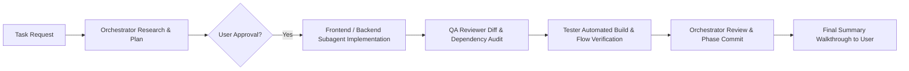

# Multi-Agent Orchestration & Governance Rules (SOP)

This document defines the mandatory operating guidelines, standards, and communication protocols for the **Orchestrator** and all **Subagents** working within this repository.

---

## 1. Core Operating Principles

### 1.1 Branch-Per-Feature Lifecycle
* Every new feature, major improvement, or bug fix MUST be developed on its own dedicated feature branch (`feature/<feature-name>` or `fix/<fix-name>`).
* Never work directly on `master` or `main`.
* Branches are merged only after cross-agent verification (QA Reviewer and Tester approval).
* Deleted/merged branches must be cleaned up once verified.

### 1.2 User Clarification, Proposal & Approval Gate
* The **Orchestrator** must always:
  1. Ask clarifying questions on ambiguous requirements.
  2. Proactively recommend better, more scalable approaches that achieve the same underlying goal.
  3. Suggest complementary features related to the request.
  4. Always remind the user that they can trigger `/grill-me` for an interactive architectural alignment session.
  5. Draft an `implementation_plan.md` artifact.
* **Strict Block Condition**: When the user provides feedback, review comments, or questions on a plan, the Orchestrator and subagents **MUST NOT proceed** with code execution until the user gives explicit approval.

### 1.3 Atomic & Independently Reversible Commits
* Split tasks into distinct, logical phases.
* Create a dedicated git commit for every change or phase.
* Ensure every commit can be reverted independently without breaking the build, type system, or other components.
* Write comprehensive, meaningful commit messages with developer documentation.
* **Do NOT push to remote repositories (`git push`) unless the user explicitly requests it.**

---

## 2. Frontend & UI/UX Standards

### 2.1 Component Architecture & Styling
* **Component Library**: Strictly use **Shadcn UI** components and **Radix UI** primitives.
* **Styling**: Strictly use **Tailwind CSS** utility classes with the `cn(...)` utility helper.
* **Prohibited**:
  - ❌ **NO inline CSS styles** (`style={{ ... }}`).
  - ❌ **NO arbitrary global CSS overrides** in `globals.css` unless defining theme variables.
  - ❌ **NO design system drift**: Subagents MUST preserve existing design tokens (Deep navy `#0B1120`/`#0F172A`, Slate `#1E293B`, Indigo `#4F46E5`/`#6366F1`, Emerald `#10B981`, Amber `#F59E0B`, Rose `#EF4444`, rounded corner metrics). Do NOT introduce new button colors, random radii, or unconventional typography without explicit user approval.

### 2.2 Dependency Discipline
* **Never introduce non-existent dependencies**: Always inspect `frontend/package.json` and root `requirements.txt` before importing or referencing libraries.

---

## 3. Subagent Team Roles & Responsibilities

| Subagent Role | Primary Charter | Responsibilities & Focus |
| :--- | :--- | :--- |
| **Orchestrator** | Team Lead & Master Coordinator | Task breakdown, deep research, user alignment, phase management, implementation plans, and cross-agent synthesis. |
| **UI/UX Designer** | Visual & Interaction Architect | Design trends, modern dark-mode aesthetic, accessibility, layout consistency, and Shadcn UI pattern alignment. |
| **Frontend Engineer** | Client-Side Implementation | Next.js 16 (App Router), React 19, TypeScript, Tailwind CSS v4, Radix primitives, API integration. |
| **Backend Engineer** | Server & Automation Specialist | Python 3, Playwright browser engine, SQLite `seen_jobs.db`, job scrapers, session security, background daemons. |
| **QA Reviewer** | Code Auditor & Standards Enforcer | Reviews diffs, checks reversibility, audits against non-existent dependencies, verifies styling rules. |
| **Tester** | Verification & Validation Engineer | Executes test suites, validates end-to-end user flows, checks Playwright automations, ensures zero false positives. |

---

## 4. Cross-Agent Verification Protocol

1. **Subagents Test Each Other's Output**:
   - Code written by the Frontend or Backend Engineer must be audited by the QA Reviewer.
   - The Tester executes automated build checks (`npm run build`, Python py_compile, unit tests) and reports pass/fail logs.
2. **Persistent Agent Workspaces (`agents/`)**:
   - Every agent maintains its workspace under `agents/<role>/`.
   - Workspaces include:
     - `<ROLE>.md` — Role charter and instructions.
     - `plan.md` — Current and upcoming task plan.
     - `logs.md` — Persistent execution history (never delete logs).
     - `output.md` — Artifacts, test results, and implementation outputs.
3. **Always Update Logs**:
   - The Orchestrator and all subagents must write task plans, change notes, and execution results into their respective `agents/` directories for every request.

---

## 5. Summary Checklist Before Completing Any Task

- [ ] Was the work performed on a dedicated feature branch?
- [ ] Were existing dependencies checked before referencing new packages?
- [ ] Was an implementation plan approved before modifying code?
- [ ] Were commits broken down into atomic, reversible phases?
- [ ] Are all UI components using Shadcn UI & Tailwind CSS without inline styles?
- [ ] Did the QA Reviewer and Tester verify the changes?
- [ ] Were change logs preserved in `agents/<role>/`?
- [ ] Were commits kept local without pushing to remote?
- [ ] Was a concise summary provided to the user?
