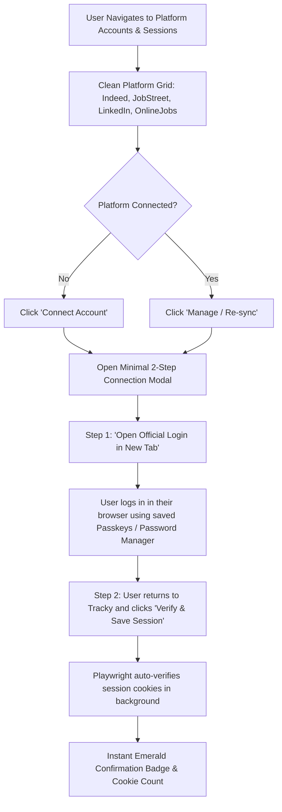

# Enterprise UI/UX Design Specifications & Visual Audit

**Author**: UI/UX Designer Subagent  
**Date**: August 28, 2026  
**Status**: Ready for Implementation  

---

## 1. Executive Summary & Design Vision

Tracky's user interface is evolving into an enterprise-grade, high-density, minimal job automation console inspired by **Linear**, **Raycast**, and **Vercel**. 

### Key Pillars:
1. **Zero Emojis**: All legacy unicode emojis (e.g. 🏢, 📍, 💰, 📄, 🤖, 📝, ⚙️, 📸, 🔍) are completely eradicated in favor of 16px/14px crisp **Lucide Icons** with dedicated semantic color accents.
2. **Streamlined Connection Architecture**: Removal of cluttered desktop browser selection widgets ("Safari / Brave / Chrome / Firefox / Edge") in favor of a sleek, 2-step **"Open in New Tab" → "Verify Session"** flow.
3. **Linear / Raycast Visual Aesthetic**:
   - Deep obsidian canvas (`#0B0F17`) with glassmorphic cards (`bg-slate-900/60 backdrop-blur-xl border border-white/10`).
   - 1px hairline borders with subtle stateful hover glows (`hover:border-slate-700/80` and `focus-visible:ring-1 focus-visible:ring-indigo-500`).
   - Clean typography hierarchy using Geist Sans with monospace accents for dates, timestamps, and numbers.
   - Unified status badges with subtle colored translucent pills (`bg-<color>-500/10 text-<color>-400 border-<color>-500/20`).
   - Strict adherence to Tailwind CSS utility tokens with **zero inline CSS styles**.

---

## 2. Complete UI Emoji Audit & Lucide Icon Replacement Matrix

| Component File | Location / Context | Current Emoji Usage | Proposed Lucide Icon Replacement & Styling |
| :--- | :--- | :--- | :--- |
| `components/sidebar.tsx` | Line 110 (Resume pill footer) | `📄` | `<FileText className="w-4 h-4 text-slate-400 shrink-0" />` |
| `components/tabs/jobs-tab.tsx` | Line 74 (Empty state icon) | `🔍` | `
<Search className="w-5 h-5 text-slate-400" />
` |
| `components/tabs/jobs-tab.tsx` | Line 122 (Company metadata) | `🏢 {job.company}` | `
<Building2 className="w-3.5 h-3.5 text-slate-400 shrink-0" />{job.company}
` |
| `components/tabs/jobs-tab.tsx` | Line 123 (Location metadata) | `📍 {job.location}` | `
<MapPin className="w-3.5 h-3.5 text-slate-400 shrink-0" />{job.location}
` |
| `components/tabs/jobs-tab.tsx` | Line 124 (Salary metadata) | `💰 {job.salary}` | `
<Banknote className="w-3.5 h-3.5 text-emerald-400 shrink-0" />{job.salary}
` |
| `components/tabs/profile-tab.tsx` | Line 76 (Resume card title) | `📄 Authentic Resume` | `<CardTitle className="text-base flex items-center gap-2"><FileCheck className="w-4 h-4 text-indigo-400" />Authentic Resume</CardTitle>` |
| `components/tabs/profile-tab.tsx` | Line 181 (Gemini button text) | `✨ Auto-Fill Profile...` | Clean text: `{isAnalyzing ? "Gemini AI Analyzing Resume..." : "Auto-Fill Profile with Gemini AI"}` (Icon `<Sparkles className="w-3.5 h-3.5 text-amber-300" />` already present) |
| `components/tabs/profile-tab.tsx` | Line 194 (Personal info title) | `👤 Personal Information` | `<CardTitle className="text-base flex items-center gap-2"><User className="w-4 h-4 text-indigo-400" />Personal Information</CardTitle>` |
| `components/tabs/screening-tab.tsx` | Line 52 (Screening card title) | `📝 Screening & Work Preferences` | `<CardTitle className="text-base flex items-center gap-2"><Sliders className="w-4 h-4 text-indigo-400" />Screening & Work Preferences</CardTitle>` |
| `components/tabs/autoapply-tab.tsx` | Line 59 (Auto-apply card title) | `🤖 Autonomous Auto-Apply Guardrails` | `<CardTitle className="text-base font-semibold text-white">Autonomous Auto-Apply Guardrails</CardTitle>` (Header already has `<Bot className="w-4 h-4 text-indigo-400" />` badge container) |
| `components/tabs/sessions-tab.tsx` | Line 243 (Connect modal button) | `⚙️ Manage & Re-sync` / `🔑 Connect Account` | Use clean text `{sess.connected ? "Manage & Re-sync" : "Connect Account"}` paired with `<KeyRound className="w-3.5 h-3.5" />` |
| `components/tabs/history-tab.tsx` | Line 39 (History card title) | `📊 Application History & Confirmation Proofs` | `<CardTitle className="text-base font-bold text-white flex items-center gap-2"><BarChart3 className="w-4 h-4 text-indigo-400" />Application History & Confirmation Proofs</CardTitle>` |
| `components/tabs/history-tab.tsx` | Line 124 (History company) | `🏢 {app.company || "Company"}` | `
<Building2 className="w-3.5 h-3.5 text-slate-400 shrink-0" />{app.company || "Company"}
` |
| `components/tabs/settings-tab.tsx` | Line 74 (Settings card title) | `⚙️ Search & Daemon Configuration` | `<CardTitle className="text-base flex items-center gap-2"><Settings className="w-4 h-4 text-indigo-400" />Search & Daemon Configuration</CardTitle>` |
| `components/modals/connect-platform-modal.tsx` | Line 333 (Verify button text) | `✅ I've Logged In — Verify & Save` | Clean text: `I&apos;ve Logged In — Verify & Save` with `<CheckCircle2 className="w-3.5 h-3.5 text-emerald-400" />` |
| `components/modals/apply-modal.tsx` | Lines 89, 93 (Job header info) | `📍 {location}`, `🏢 {company}` | `<MapPin className="w-3.5 h-3.5 text-slate-400" />`, `<Building2 className="w-3.5 h-3.5 text-slate-400" />` |
| `components/modals/apply-modal.tsx` | Lines 156, 160, 165, 169, 172 (Profile chips) | `👤`, `✉️`, `📞`, `💼`, `💰` | `<User className="w-3 h-3 text-indigo-400" />`, `<Mail className="w-3 h-3 text-indigo-400" />`, `<Phone className="w-3 h-3 text-indigo-400" />`, `<Briefcase className="w-3 h-3 text-indigo-400" />`, `<Banknote className="w-3 h-3 text-emerald-400" />` |
| `components/modals/screenshot-modal.tsx` | Line 25 (Modal title) | `📸 Application Confirmation Proof` | `<DialogTitle className="text-base flex items-center gap-2"><Camera className="w-4 h-4 text-indigo-400" />Application Confirmation Proof</DialogTitle>` |
| `app/page.tsx` | Lines 230, 243, 250, 301 (Sonner toasts) | `✨ Resume uploaded...`, `🎉 Session connected...` | Strip emojis in toast messages for crisp enterprise system feedback |

---

## 3. Sleek 'Open in New Tab' Connection Flow (Removal of Browser Selection Controls)

### 3.1 Problem with Existing Design
- `SessionsTab` and `SettingsTab` displayed heavy browser picker grids with icons for Safari, Brave, Chrome, Firefox, Arc/Edge.
- Every platform card featured a split-button with a dropdown selector for desktop browser binaries.
- This creates unnecessary cognitive overhead. Users simply want to link their Indeed/JobStreet/LinkedIn/OnlineJobs accounts using their existing web browser session without fiddling with browser engine settings.

### 3.2 New Streamlined UX Architecture

### 3.3 UI Component Redesign Details

#### A. Platform Card in `sessions-tab.tsx`:
- **Clean Card Header**:
  - Platform Icon (10x10 rounded-xl with subtle tinted accent border: Indeed = Blue, JobStreet = Pink, LinkedIn = Sky, OnlineJobs = Emerald).
  - Status Badge: `<Badge variant="success">Connected</Badge>` or `<Badge variant="secondary">Not Connected</Badge>`.
- **Card Body**:
  - Platform Name (e.g. `Indeed.ph`) and crisp 1-sentence capability descriptor.
  - Session meta: `Last synced: <timestamp>` and `<cookie_count> cookies`.
- **Card Action**:
  - A single full-width high-contrast Button:
    - If disconnected: `<Button variant="default"><ExternalLink className="w-3.5 h-3.5" /> Connect Account</Button>`
    - If connected: `<Button variant="secondary"><RefreshCw className="w-3.5 h-3.5" /> Manage & Re-sync</Button>`
- **Removed**:
  - ❌ Top "Default Login Browser" banner card.
  - ❌ Split button with browser icon & dropdown menu.
  - ❌ Secondary browser selection buttons.

#### B. Connection Modal `connect-platform-modal.tsx`:
- Focuses entirely on a frictionless 2-step flow:
  1. **Step 1 Card**: 
     - Heading: "1. Authenticate in Your Browser"
     - Subtitle: "Open the official login portal in a new tab. Log in using your credentials, Google Auth, or Passkey."
     - Action: `<Button variant="outline" className="w-full justify-between">Open {Platform} in New Tab<ExternalLink className="w-4 h-4 text-indigo-400" /></Button>`
  2. **Step 2 Card**:
     - Heading: "2. Verify & Save Session"
     - Subtitle: "Once logged in, click verify to snapshot your authenticated session cookies for automated application submissions."
     - Action: `<Button variant="default" className="w-full bg-indigo-600 hover:bg-indigo-500"><CheckCircle2 className="w-4 h-4 text-emerald-400" /> Verify Session</Button>`
- Instant verification feedback with animated checkmark and cookie count badge.
- **Removed**:
  - ❌ Browser picker radio list (`Safari / Brave / Chrome / Firefox / Arc`).
  - ❌ Manual browser executable launch selector.

#### C. `settings-tab.tsx`:
- Removed the "Default Interactive & Login Browser" selection panel.
- Kept only essential operational daemon controls:
  - Gemini AI API Key input with password masking and helper copy.
  - Search keywords textarea.
  - Search location and scrape interval (minutes).
  - iMessage recipient endpoint.

---

## 4. Linear / Raycast Design System Specifications

### 4.1 Color System & Tokens
| Semantic Role | Token / Tailwind Class | Hex / HSL Reference | Purpose |
| :--- | :--- | :--- | :--- |
| **Canvas Background** | `bg-[#0b0f17]` / `bg-slate-950` | `#0B0F17` | Deep dark void base canvas |
| **Surface Card** | `bg-slate-900/60 backdrop-blur-xl` | `rgba(15, 23, 42, 0.60)` | Primary container surface |
| **Sub-Surface / Inset** | `bg-slate-950/60` | `rgba(2, 6, 23, 0.60)` | Form fields, tables, inner containers |
| **Hairline Border** | `border-white/10` or `border-slate-800/80` | `rgba(255, 255, 255, 0.08)` | Ultra-clean 1px structure |
| **Active / Hover Border** | `hover:border-white/20` / `hover:border-slate-700` | `rgba(255, 255, 255, 0.16)` | Subtle tactile feedback |
| **Primary Brand** | `bg-indigo-600 hover:bg-indigo-500` | `#4F46E5` / `#6366F1` | Primary CTA, focus highlights |
| **Focus Ring** | `focus-visible:ring-1 focus-visible:ring-indigo-500` | `#6366F1` | Accessible keyboard focus outline |
| **Status - Success** | `text-emerald-400 bg-emerald-500/10 border-emerald-500/20` | `#10B981` | Submitted, connected, verified |
| **Status - Warning** | `text-amber-400 bg-amber-500/10 border-amber-500/20` | `#F59E0B` | External portal, paused, caution |
| **Status - Destructive** | `text-rose-400 bg-rose-500/10 border-rose-500/20` | `#EF4444` | Failed, missing resume, error |

### 4.2 Typography & Hierarchy
- **Font Stack**: `font-sans` (`Geist`, `Inter`, system-ui), with `font-mono` (`Geist Mono`) for timestamps, badges, metrics, and file sizes.
- **Scale**:
  - `Page Heading`: `text-2xl font-bold tracking-tight text-white`
  - `Card Title`: `text-base font-semibold tracking-tight text-white`
  - `Body / Labels`: `text-sm font-medium text-slate-200`
  - `Muted / Subtitles`: `text-xs text-slate-400 leading-relaxed`
  - `Micro / Badges / Counters`: `text-[11px] font-mono font-medium`

### 4.3 Interactive Elements & Micro-Transitions
- **Buttons**:
  - Standard height: `h-9` (`h-8` for `size="sm"`), `rounded-lg`.
  - Transitions: `transition-all duration-150 ease-out active:scale-[0.98]`.
  - Icon-text gap: `gap-2` (`gap-1.5` for compact).
- **Form Controls**:
  - `Input` & `Textarea`: `bg-slate-950/60 border-white/10 text-slate-100 placeholder:text-slate-500 rounded-lg focus-visible:ring-1 focus-visible:ring-indigo-500 focus-visible:border-indigo-500/50`.
  - Replace unstyled HTML `<select>` with custom styled dark select containers featuring a `<ChevronDown className="w-4 h-4 text-slate-400" />` right-aligned indicator.
- **Modals / Dialogs**:
  - Backdrop: `bg-black/80 backdrop-blur-md`.
  - Dialog Frame: `bg-slate-900/95 border border-white/10 shadow-2xl rounded-2xl p-6`.

### 4.4 Zero Inline Styles Guarantee
- 100% of layout, colors, padding, borders, typography, and states use Tailwind CSS utility classes composed via the `cn(...)` helper.
- No `style={{ ... }}` attributes exist in any component.

---

## 5. Next Steps for Frontend Implementation

1. **Phase 1**: Execute emoji-to-Lucide replacements across `sidebar.tsx`, `jobs-tab.tsx`, `profile-tab.tsx`, `screening-tab.tsx`, `autoapply-tab.tsx`, `history-tab.tsx`, `settings-tab.tsx`, `apply-modal.tsx`, `screenshot-modal.tsx`, and `page.tsx`.
2. **Phase 2**: Refactor `sessions-tab.tsx`, `connect-platform-modal.tsx`, and `settings-tab.tsx` to implement the minimal "Open in New Tab" connection flow and remove browser selection widgets.
3. **Phase 3**: Upgrade select dropdowns in `jobs-tab.tsx` and `screening-tab.tsx` to polished dark controls.
4. **Phase 4**: Verify zero compilation errors with `npm run build` and run QA Reviewer audit.

